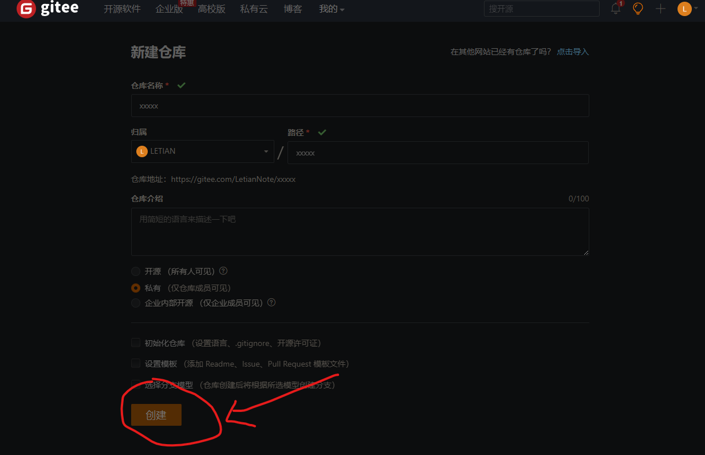

# machine Learning 
## 环境搭建
### 组成 vscode + gitee
### 创建gitte代码仓库

### 配置git
安装git就不说了

#### 打开 gitbash 进行配置
    配置 name 和 emali 输入以下命令

```git
git config --global user.name "name"
git config --global user.email "email"
``` 


### 复制仓库链接

### VSCODE 连接代码产库 
    把刚才复制得链接复制到这里

    之后会需要你输入gitte的账户密码输入就好了 然后选择一个本地的文件夹 作为工作区 选择一个就好


### 测试是否连接成功  
 随便建个文件写点东西 我写了一个md文件 然后 写了点东西 如下图 保存一下

点开这个

这时候会发现 changes 下面有刚刚创建修改的文件

然后点那个加号 把修改提交到暂存区 如下图

现在可以点击 Commit 然后点push 就把文件同步到代码产库了


现在回到gitte 上有没有刚才那个文件 有的话就 同步成功了

hhh我的同步成功了 你的呢

## 通过pip安装python 第三方库 
### 更改pip源
#### Windows 
在``C:\Users\username\AppData\Roaming\pip``下创建一个``pip.ini``的文件把下面的代码复制进去
```ini
[global]
timeout = 6000
index-url = https://pypi.tuna.tsinghua.edu.cn/simple
trusted-host = pypi.tuna.tsinghua.edu.cn
```
保存退出 这样子pip源就换好了

#### 安装命令

``pip install name``